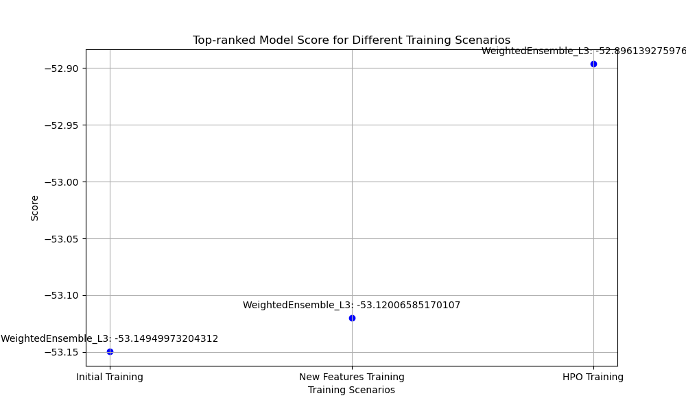
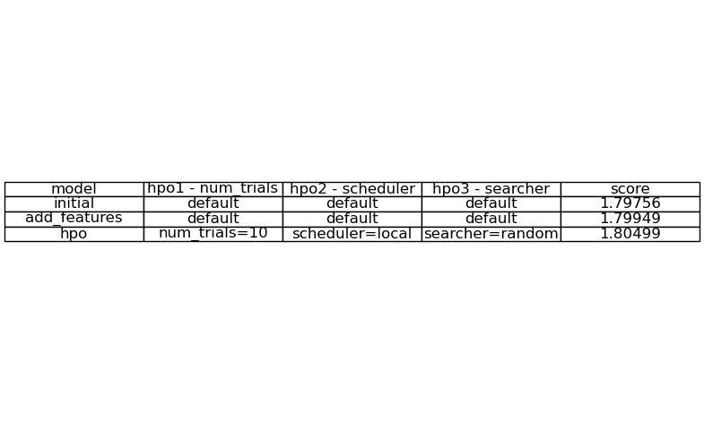
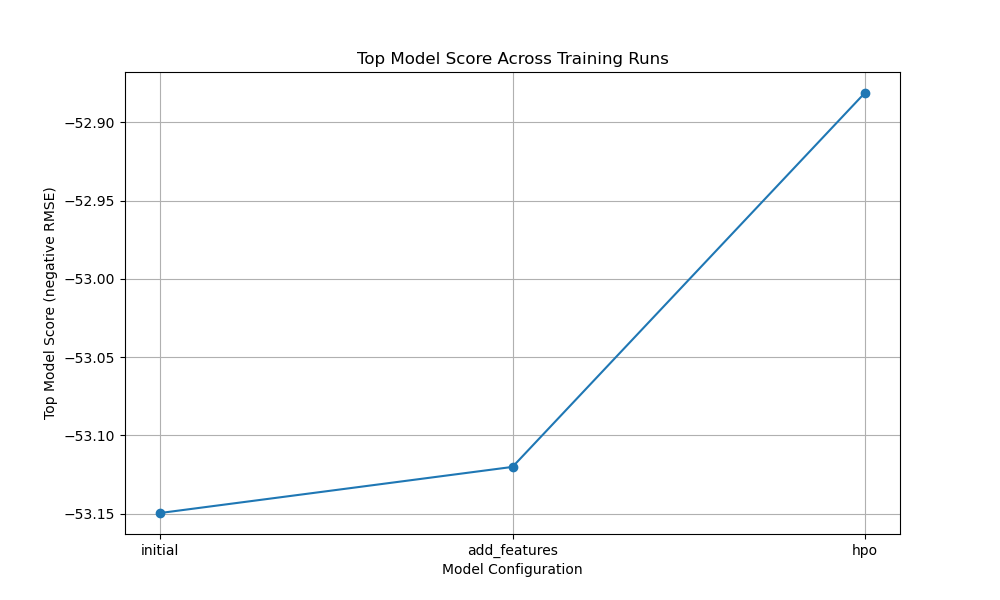
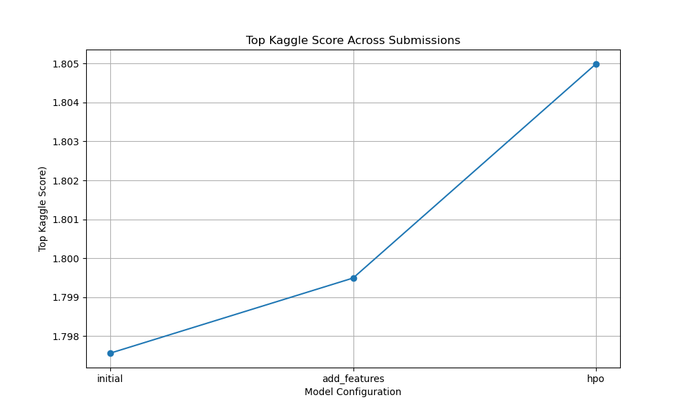

# Report: Predict Bike Sharing Demand with AutoGluon Solution
#### NAME Marcelle Candy

## Initial Training
### What did you realize when you tried to submit your predictions? What changes were needed to the output of the predictor to submit your results?
TODO: In order to meet Kaggle's submission criteria and not have the submission rejected the output required identifying all negative values and setting them to zero.

### What was the top ranked model that performed?
TODO: To determine the top ranked model I added .leaderboard() after submission, submission_new_features and submission_new_hpo to easily identify the top ranked model of each trained model.  This indicated that all three had the Best model: "WeightedEnsemble_L3" when plotting these and using score_val feature it shows that the HPO training has the lowest RMSE of approx -52.88 indicating that it performed the best among the given scenarios.

## Exploratory data analysis and feature creation
### What did the exploratory analysis find and how did you add additional features?
TODO: The EDA helped to understand the distribution of data and identify patterns.  Adding histograms helped to identify temporal patterns and the additional time-realted features identified demand based on hours, days and months and adding categorical encoding of the features 'season' and 'weather' ensured that the features were interpreted correctly.  By incorporating histograms, additioanl features and categorical encoding we can capture underlying patterns in the data which can improve performance. 

### How much better did your model preform after adding additional features and why do you think that is?
TODO: Adding the additional features and performing EDA the models performance improved. Looking at the RMSE the the intial training was -53.12 and the new_feature training was -53.13 which indicates improvement.  By adding the additional time-related features the model was enriched and able to gain further insights and make more informed predictions into how the bike-sharing demand varied over time. 

## Hyper parameter tuning
### How much better did your model preform after trying different hyper parameters?
TODO: There was still improvement after performing hyperparameter tuning.  The RMSE decreased from -53.13 in the new_features training to -52.88 in the HPO training indicting an improvement. In changing the way the model sees the data by fine-tuning it, optimising the models configurations and improving generalisation on unseen data the model gives more accurate predictions.

### If you were given more time with this dataset, where do you think you would spend more time?
TODO: I would add more feature engineering by introducing either new features or external datasets to supplement the model to find more underlying data patterns.  I would also look at refining the model with different algorithms or ensemble methods which could lead to further performance improvements.

### Create a table with the models you ran, the hyperparameters modified, and the kaggle score.

### Create a line plot showing the top model score for the three (or more) training runs during the project.

TODO: Replace the image below with your own.

### Create a line plot showing the top kaggle score for the three (or more) prediction submissions during the project.

TODO: Replace the image below with your own.

## Summary
TODO: This project predicts bike sharing demand by training and evaluating models.  First I signed up on Kaggle and downloaded the dataset and API key.  Then, I trained a basic model using AutoGluon's TabularPredictor and assessed its performance using root mean squared error (RMSE).  After submitting the predictions to Kaggle EDA was performed using histograms, adding more time-related features and encoding categorical data to help discover and understand the data's patterns.  The modle was then retrained with the new features and results submitted to Kaggle.  To further improve performance hyperparameters were used to opimise performance. The model was retrained for a third time and again the results were submitted to Kaggle.  Autogluon simplified the model training and hyperparameter tuning and visuals were plotted to easily identify the model's top score and the top Kaggle score showing that with each stage that by adding features and hyperparameters you can refine and optimise your models performance.